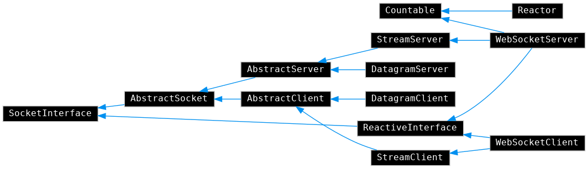

Helix::Socket
-------------

Standalone object-oriented BSD Sockets and WebSockets in `PHP 7.4`

[](https://www.php.net)
[](https://packagist.org/packages/hfw/socket)
[](LICENSE.txt)
[](https://scrutinizer-ci.com/g/hfw/socket)
[](https://scrutinizer-ci.com/g/hfw/socket)

Built around `sockets.c` to ensure optimal integration.

Documentation: https://hfw.github.io/socket

Installation
------------

```
composer require "hfw/socket"
```

Class Diagram
-------------

[](https://hfw.github.io/socket/inherits.html)
